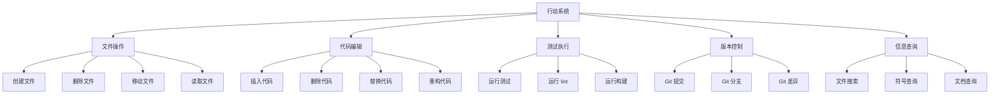

# Action 行动子系统

## 📚 概述

行动子系统定义了 Agent 在代码环境中可以执行的所有操作，包括文件操作、代码编辑、测试运行等。它是 Agent 与环境交互的"手和脚"。

## 🏗️ 架构设计



## 🎬 动作空间

### 1. 文件操作 (File Operations)

```python
class FileOperations:
    @staticmethod
    def create_file(filepath: str, content: str = "") -> dict:
        """创建新文件"""
        try:
            os.makedirs(os.path.dirname(filepath), exist_ok=True)
            with open(filepath, 'w', encoding='utf-8') as f:
                f.write(content)
            return {
                'success': True,
                'action': 'create_file',
                'filepath': filepath
            }
        except Exception as e:
            return {
                'success': False,
                'error': str(e)
            }
    
    @staticmethod
    def read_file(filepath: str) -> dict:
        """读取文件内容"""
        try:
            with open(filepath, 'r', encoding='utf-8') as f:
                content = f.read()
            return {
                'success': True,
                'content': content,
                'filepath': filepath
            }
        except Exception as e:
            return {
                'success': False,
                'error': str(e)
            }
    
    @staticmethod
    def delete_file(filepath: str) -> dict:
        """删除文件"""
        try:
            os.remove(filepath)
            return {
                'success': True,
                'action': 'delete_file',
                'filepath': filepath
            }
        except Exception as e:
            return {
                'success': False,
                'error': str(e)
            }
    
    @staticmethod
    def move_file(src: str, dst: str) -> dict:
        """移动或重命名文件"""
        try:
            os.makedirs(os.path.dirname(dst), exist_ok=True)
            shutil.move(src, dst)
            return {
                'success': True,
                'action': 'move_file',
                'source': src,
                'destination': dst
            }
        except Exception as e:
            return {
                'success': False,
                'error': str(e)
            }
```

### 2. 代码编辑 (Code Editing)

```python
import re
from difflib import SequenceMatcher

class CodeEditor:
    @staticmethod
    def insert_code(filepath: str, line_number: int, code: str) -> dict:
        """在指定行插入代码"""
        try:
            with open(filepath, 'r', encoding='utf-8') as f:
                lines = f.readlines()
            
            # 插入代码
            lines.insert(line_number - 1, code + '\n')
            
            with open(filepath, 'w', encoding='utf-8') as f:
                f.writelines(lines)
            
            return {
                'success': True,
                'action': 'insert_code',
                'filepath': filepath,
                'line': line_number
            }
        except Exception as e:
            return {
                'success': False,
                'error': str(e)
            }
    
    @staticmethod
    def delete_code(filepath: str, start_line: int, end_line: int) -> dict:
        """删除指定范围的代码"""
        try:
            with open(filepath, 'r', encoding='utf-8') as f:
                lines = f.readlines()
            
            # 删除代码
            del lines[start_line - 1:end_line]
            
            with open(filepath, 'w', encoding='utf-8') as f:
                f.writelines(lines)
            
            return {
                'success': True,
                'action': 'delete_code',
                'filepath': filepath,
                'start_line': start_line,
                'end_line': end_line
            }
        except Exception as e:
            return {
                'success': False,
                'error': str(e)
            }
    
    @staticmethod
    def replace_code(filepath: str, old_code: str, new_code: str) -> dict:
        """替换代码片段"""
        try:
            with open(filepath, 'r', encoding='utf-8') as f:
                content = f.read()
            
            # 替换代码
            if old_code not in content:
                return {
                    'success': False,
                    'error': 'Old code not found in file'
                }
            
            content = content.replace(old_code, new_code)
            
            with open(filepath, 'w', encoding='utf-8') as f:
                f.write(content)
            
            return {
                'success': True,
                'action': 'replace_code',
                'filepath': filepath
            }
        except Exception as e:
            return {
                'success': False,
                'error': str(e)
            }
    
    @staticmethod
    def find_and_replace(filepath: str, pattern: str, replacement: str) -> dict:
        """使用正则表达式查找替换"""
        try:
            with open(filepath, 'r', encoding='utf-8') as f:
                content = f.read()
            
            # 正则替换
            content, count = re.subn(pattern, replacement, content)
            
            with open(filepath, 'w', encoding='utf-8') as f:
                f.write(content)
            
            return {
                'success': True,
                'action': 'find_and_replace',
                'filepath': filepath,
                'replacements': count
            }
        except Exception as e:
            return {
                'success': False,
                'error': str(e)
            }
```

### 3. 测试执行 (Test Execution)

```python
import subprocess
import json

class TestExecutor:
    @staticmethod
    def run_tests(test_file: str = None, test_pattern: str = None) -> dict:
        """运行测试"""
        try:
            cmd = ['python', '-m', 'pytest', '-v', '--json-report']
            
            if test_file:
                cmd.append(test_file)
            elif test_pattern:
                cmd.extend(['-k', test_pattern])
            
            result = subprocess.run(
                cmd,
                capture_output=True,
                text=True,
                cwd=os.getcwd()
            )
            
            # 解析测试结果
            report_path = '.pytest-report.json'
            if os.path.exists(report_path):
                with open(report_path, 'r') as f:
                    report = json.load(f)
            else:
                report = None
            
            return {
                'success': True,
                'returncode': result.returncode,
                'stdout': result.stdout,
                'stderr': result.stderr,
                'report': report,
                'passed': result.returncode == 0
            }
        except Exception as e:
            return {
                'success': False,
                'error': str(e)
            }
    
    @staticmethod
    def run_linter(filepath: str = None) -> dict:
        """运行代码检查"""
        try:
            cmd = ['flake8']
            if filepath:
                cmd.append(filepath)
            
            result = subprocess.run(
                cmd,
                capture_output=True,
                text=True,
                cwd=os.getcwd()
            )
            
            return {
                'success': True,
                'returncode': result.returncode,
                'stdout': result.stdout,
                'stderr': result.stderr,
                'clean': result.returncode == 0
            }
        except Exception as e:
            return {
                'success': False,
                'error': str(e)
            }
    
    @staticmethod
    def run_build() -> dict:
        """运行构建"""
        try:
            # 尝试常见的构建命令
            build_commands = [
                ['python', '-m', 'build'],
                ['make', 'build'],
                ['npm', 'run', 'build']
            ]
            
            for cmd in build_commands:
                try:
                    result = subprocess.run(
                        cmd,
                        capture_output=True,
                        text=True,
                        cwd=os.getcwd()
                    )
                    if result.returncode == 0:
                        return {
                            'success': True,
                            'command': cmd,
                            'stdout': result.stdout,
                            'stderr': result.stderr
                        }
                except:
                    continue
            
            return {
                'success': False,
                'error': 'No valid build command found'
            }
        except Exception as e:
            return {
                'success': False,
                'error': str(e)
            }
```

### 4. 版本控制 (Version Control)

```python
class GitOperations:
    @staticmethod
    def git_status() -> dict:
        """获取 Git 状态"""
        try:
            result = subprocess.run(
                ['git', 'status', '--porcelain'],
                capture_output=True,
                text=True,
                cwd=os.getcwd()
            )
            return {
                'success': True,
                'status': result.stdout.strip()
            }
        except Exception as e:
            return {
                'success': False,
                'error': str(e)
            }
    
    @staticmethod
    def git_diff(filepath: str = None) -> dict:
        """获取 Git 差异"""
        try:
            cmd = ['git', 'diff']
            if filepath:
                cmd.append(filepath)
            
            result = subprocess.run(
                cmd,
                capture_output=True,
                text=True,
                cwd=os.getcwd()
            )
            return {
                'success': True,
                'diff': result.stdout
            }
        except Exception as e:
            return {
                'success': False,
                'error': str(e)
            }
    
    @staticmethod
    def git_commit(message: str, files: list = None) -> dict:
        """Git 提交"""
        try:
            if files:
                subprocess.run(['git', 'add'] + files, cwd=os.getcwd())
            else:
                subprocess.run(['git', 'add', '.'], cwd=os.getcwd())
            
            result = subprocess.run(
                ['git', 'commit', '-m', message],
                capture_output=True,
                text=True,
                cwd=os.getcwd()
            )
            
            return {
                'success': result.returncode == 0,
                'stdout': result.stdout,
                'stderr': result.stderr
            }
        except Exception as e:
            return {
                'success': False,
                'error': str(e)
            }
```

### 5. 信息查询 (Information Query)

```python
import ast
from pathlib import Path

class InformationQuerier:
    @staticmethod
    def search_files(pattern: str, directory: str = '.') -> dict:
        """搜索文件"""
        try:
            matches = list(Path(directory).rglob(pattern))
            return {
                'success': True,
                'matches': [str(m) for m in matches]
            }
        except Exception as e:
            return {
                'success': False,
                'error': str(e)
            }
    
    @staticmethod
    def search_code(pattern: str, directory: str = '.') -> dict:
        """在代码中搜索"""
        try:
            results = []
            for filepath in Path(directory).rglob('*.py'):
                with open(filepath, 'r', encoding='utf-8') as f:
                    content = f.read()
                    if re.search(pattern, content):
                        results.append(str(filepath))
            return {
                'success': True,
                'matches': results
            }
        except Exception as e:
            return {
                'success': False,
                'error': str(e)
            }
    
    @staticmethod
    def get_symbols(filepath: str) -> dict:
        """获取文件中的符号（函数、类等）"""
        try:
            with open(filepath, 'r', encoding='utf-8') as f:
                content = f.read()
            
            tree = ast.parse(content)
            symbols = {
                'functions': [],
                'classes': [],
                'variables': []
            }
            
            for node in ast.walk(tree):
                if isinstance(node, ast.FunctionDef):
                    symbols['functions'].append({
                        'name': node.name,
                        'lineno': node.lineno,
                        'args': [arg.arg for arg in node.args.args]
                    })
                elif isinstance(node, ast.ClassDef):
                    symbols['classes'].append({
                        'name': node.name,
                        'lineno': node.lineno,
                        'methods': [
                            m.name for m in node.body
                            if isinstance(m, ast.FunctionDef)
                        ]
                    })
            
            return {
                'success': True,
                'symbols': symbols
            }
        except Exception as e:
            return {
                'success': False,
                'error': str(e)
            }
```

## 🎯 动作选择策略

```python
import numpy as np

class ActionSelector:
    def __init__(self, action_space, epsilon=0.1):
        self.action_space = action_space
        self.epsilon = epsilon
        
    def select_action(self, state, policy_network):
        """选择动作"""
        if np.random.random() < self.epsilon:
            # 探索：随机选择
            return self._random_action()
        else:
            # 利用：根据策略选择
            return self._policy_action(state, policy_network)
    
    def _random_action(self):
        """随机选择动作"""
        action_type = np.random.choice(list(self.action_space.keys()))
        action_params = self._sample_params(action_type)
        return {
            'type': action_type,
            'params': action_params
        }
    
    def _policy_action(self, state, policy_network):
        """根据策略选择动作"""
        action_probs = policy_network(state)
        action_idx = np.argmax(action_probs)
        action_type = list(self.action_space.keys())[action_idx]
        action_params = self._sample_params(action_type)
        return {
            'type': action_type,
            'params': action_params
        }
    
    def _sample_params(self, action_type):
        """采样动作参数"""
        if action_type == 'edit':
            return {
                'file': np.random.choice(['main.py', 'utils.py']),
                'operation': np.random.choice(['insert', 'delete', 'replace'])
            }
        elif action_type == 'test':
            return {
                'scope': np.random.choice(['all', 'specific', 'failed'])
            }
        else:
            return {}
```

## 📊 动作执行器

```python
class ActionExecutor:
    def __init__(self):
        self.file_ops = FileOperations()
        self.code_editor = CodeEditor()
        self.test_executor = TestExecutor()
        self.git_ops = GitOperations()
        self.info_querier = InformationQuerier()
        
    def execute(self, action: dict) -> dict:
        """执行动作"""
        action_type = action['type']
        params = action.get('params', {})
        
        if action_type == 'create_file':
            return self.file_ops.create_file(params['filepath'], params.get('content', ''))
        elif action_type == 'read_file':
            return self.file_ops.read_file(params['filepath'])
        elif action_type == 'edit_code':
            return self.code_editor.replace_code(
                params['filepath'],
                params['old_code'],
                params['new_code']
            )
        elif action_type == 'run_tests':
            return self.test_executor.run_tests(
                params.get('test_file'),
                params.get('test_pattern')
            )
        elif action_type == 'git_diff':
            return self.git_ops.git_diff(params.get('filepath'))
        elif action_type == 'search_code':
            return self.info_querier.search_code(params['pattern'])
        else:
            return {
                'success': False,
                'error': f'Unknown action type: {action_type}'
            }
```

## 🔧 配置参数

```yaml
action:
  # 动作空间
  action_space:
    - create_file
    - read_file
    - delete_file
    - edit_code
    - run_tests
    - run_linter
    - git_status
    - git_diff
    - git_commit
    - search_files
    - search_code
    - get_symbols
  
  # 探索策略
  exploration:
    epsilon_start: 1.0
    epsilon_end: 0.01
    epsilon_decay: 0.995
    
  # 动作限制
  constraints:
    max_edit_size: 1000  # 单次最大编辑字符数
    max_files_per_step: 5  # 每步最多操作文件数
    dangerous_operations: False  # 是否允许危险操作（如删除整个目录）
    
  # 安全检查
  safety:
    enable_preview: True  # 执行前预览
    auto_backup: True  # 自动备份
    dry_run_mode: False  # 干运行模式
```

## 🎯 最佳实践

1. **先预览再执行**：使用 `dry_run_mode` 预览修改
2. **小步迭代**：每次只做少量修改，便于回滚
3. **频繁测试**：每次修改后运行测试验证
4. **及时提交**：重要修改后立即提交到版本控制
5. **记录操作**：保存操作历史，便于复盘

## 📚 参考资料

- OpenAI Function Calling API
- GitHub Copilot X 技术文档
- Cursor Editor 操作模式