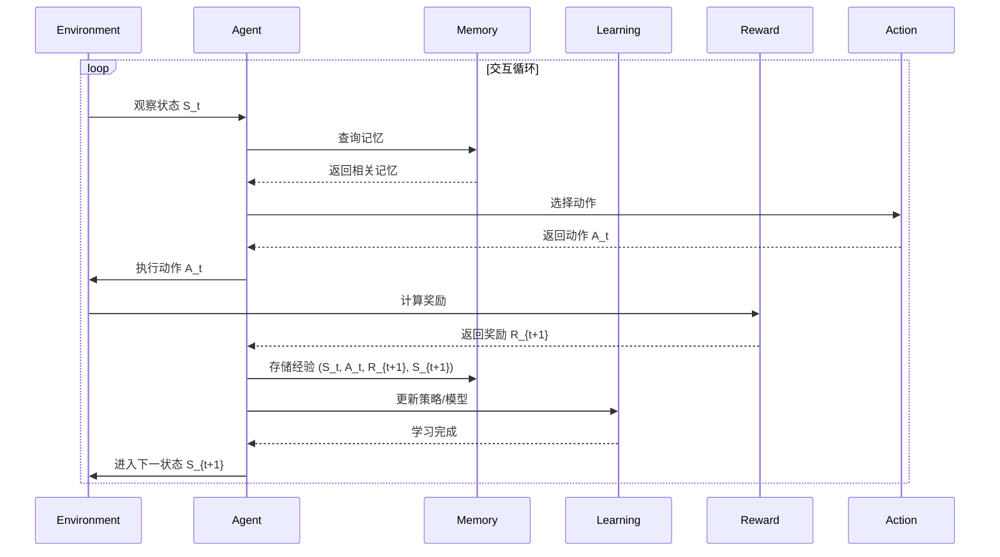

# 高级代码 Agent 系统

## 📚 系统概述

本系统是一个基于强化学习框架的智能代码 Agent，包含五个核心子系统：

```
┌─────────────────────────────────────────────────────────┐
│                    高级代码 Agent 系统                     │
├─────────────────────────────────────────────────────────┤
│  ┌──────────────┐  ┌──────────────┐  ┌──────────────┐   │
│  │   Learning   │  │    Memory    │  │    Action    │   │
│  │   (学习)     │  │   (记忆)     │  │   (行动)     │   │
│  └──────┬───────┘  └──────┬───────┘  └──────┬───────┘   │
│         │                 │                 │            │
│  ┌──────▼───────┐  ┌──────▼───────┐       │            │
│  │   Reward     │  │ Environment  │       │            │
│  │   (奖励)     │  │   (环境)     │       │            │
│  └──────────────┘  └──────────────┘       │            │
│         │                 │                 │            │
│         └─────────────────┴─────────────────┘            │
│                     交互循环                               │
└─────────────────────────────────────────────────────────┘
```

## 🔄 工作流程



## 📁 子系统结构

| 子系统 | 文件名 | 功能描述 |
|--------|--------|----------|
| 学习系统 | [learning.md](file:///workspace/learning.md) | 算法、模型训练、策略优化 |
| 记忆系统 | [memory.md](file:///workspace/memory.md) | 经验回放、长期记忆、短期记忆 |
| 行动系统 | [action.md](file:///workspace/action.md) | 动作空间、策略执行、代码操作 |
| 奖励系统 | [reward.md](file:///workspace/reward.md) | 奖励设计、奖励函数、价值评估 |
| 环境系统 | [environment.md](file:///workspace/environment.md) | 代码环境、状态表示、交互接口 |

## 🎯 核心特性

### 1. 多模态学习
- 代码理解与生成
- 版本控制历史学习
- 测试反馈学习

### 2. 层级记忆
- 工作记忆（短期）
- 经验池（中期）
- 知识库（长期）

### 3. 自适应探索
- 基于不确定性的探索策略
- 多臂老虎机方法
- 熵正则化

### 4. 代码质量奖励
- 功能正确性
- 代码可维护性
- 性能效率
- 测试覆盖率

## 🔧 快速开始

### 初始化 Agent
```python
from code_agent import CodeAgent

# 创建 Agent 实例
agent = CodeAgent(
    learning_config="learning.md",
    memory_config="memory.md",
    action_config="action.md",
    reward_config="reward.md",
    environment_config="environment.md"
)

# 开始交互
agent.start()
```

### 任务示例
```python
# 代码重构任务
task = {
    "type": "refactor",
    "file": "utils.py",
    "goal": "提高可读性和性能"
}

# 执行任务
result = agent.execute(task)
print(f"任务完成: {result.success}")
print(f"变更: {result.changes}")
```

## 📊 性能指标

| 指标 | 描述 | 目标值 |
|------|------|--------|
| 任务成功率 | 成功完成的任务比例 | > 90% |
| 平均修改次数 | 完成任务的平均步骤数 | < 10 |
| 学习收敛速度 | 达到最优策略所需经验数 | < 10000 |
| 代码质量评分 | 基于奖励函数的评分 | > 85 |

## 🔬 研究方向

- [ ] 多任务迁移学习
- [ ] 元学习（快速适应新任务）
- [ ] 自监督预训练
- [ ] 多Agent协作编程
- [ ] 人类反馈强化学习 (RLHF)

## 📝 更新日志

### v1.0.0 (2026-05-05)
- ✅ 初始系统架构设计
- ✅ 五个核心子系统定义
- ✅ 工作流程文档化
- ✅ API 接口设计

## 📄 许可证

本项目仅用于研究和学习目的。