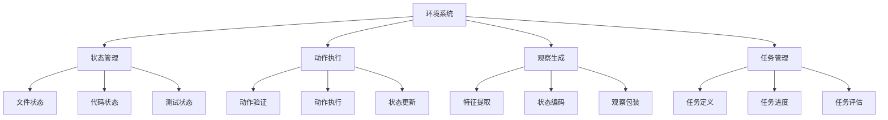

# Environment 环境子系统

## 📚 概述

环境子系统是 Agent 交互的"世界"，它维护代码库的状态，执行 Agent 的动作，并返回新的状态和奖励。它是强化学习循环中的关键组成部分。

## 🏗️ 架构设计



## 🌍 代码环境

### 基础环境类

```python
import gym
from gym import spaces
import os
import shutil
from pathlib import Path
import tempfile

class CodeEnvironment(gym.Env):
    def __init__(self, config: dict):
        super().__init__()
        
        self.config = config
        self.workspace = Path(config.get('workspace', './workspace'))
        self.initial_state = None
        self.current_state = None
        self.steps_taken = 0
        self.max_steps = config.get('max_steps', 100)
        
        # 动作空间
        self.action_space = spaces.Dict({
            'type': spaces.Discrete(10),  # 10 种动作类型
            'params': spaces.Dict({
                'filepath': spaces.Text(),
                'content': spaces.Text(),
                'line': spaces.Discrete(1000),
            })
        })
        
        # 观察空间
        self.observation_space = spaces.Dict({
            'files': spaces.Sequence(spaces.Text()),
            'code': spaces.Text(),
            'test_results': spaces.Dict(),
            'task_progress': spaces.Box(0, 1, shape=(1,)),
        })
        
        # 初始化环境
        self._init_workspace()
        
    def _init_workspace(self):
        """初始化工作空间"""
        if not self.workspace.exists():
            self.workspace.mkdir(parents=True)
        
        # 复制初始代码库
        if 'source_code' in self.config:
            source = Path(self.config['source_code'])
            if source.exists():
                shutil.copytree(source, self.workspace, dirs_exist_ok=True)
    
    def reset(self, seed: int = None, options: dict = None) -> tuple:
        """重置环境到初始状态"""
        super().reset(seed=seed)
        
        # 重置工作空间
        self._restore_initial_state()
        
        # 重置计数器
        self.steps_taken = 0
        
        # 生成初始观察
        observation = self._get_observation()
        info = self._get_info()
        
        return observation, info
    
    def step(self, action: dict) -> tuple:
        """执行一步动作"""
        # 验证动作
        if not self._validate_action(action):
            observation = self._get_observation()
            reward = -1.0
            done = False
            info = {'error': 'Invalid action'}
            return observation, reward, done, info
        
        # 执行动作
        action_result = self._execute_action(action)
        
        # 更新状态
        self._update_state(action_result)
        
        # 计算奖励
        reward = self._calculate_reward(action, action_result)
        
        # 检查是否完成
        done = self._check_done()
        
        # 生成观察
        observation = self._get_observation()
        info = self._get_info(action_result)
        
        # 增加步数
        self.steps_taken += 1
        
        return observation, reward, done, info
    
    def _validate_action(self, action: dict) -> bool:
        """验证动作合法性"""
        if 'type' not in action:
            return False
        
        # 检查动作参数
        action_type = action['type']
        params = action.get('params', {})
        
        if action_type in ['edit_code', 'read_file', 'delete_file']:
            if 'filepath' not in params:
                return False
            filepath = self.workspace / params['filepath']
            if not filepath.exists():
                return False
        
        return True
    
    def _execute_action(self, action: dict) -> dict:
        """执行动作"""
        from action import ActionExecutor
        executor = ActionExecutor()
        return executor.execute(action)
    
    def _update_state(self, action_result: dict):
        """更新环境状态"""
        self.current_state = {
            'files': list(self.workspace.rglob('*.py')),
            'last_action': action_result,
            'timestamp': None
        }
    
    def _get_observation(self) -> dict:
        """获取当前观察"""
        files = list(self.workspace.rglob('*.py'))
        code_samples = {}
        
        # 读取部分文件内容
        for file in files[:5]:  # 限制文件数量
            try:
                with open(file, 'r', encoding='utf-8') as f:
                    code_samples[str(file.relative_to(self.workspace))] = f.read()
            except:
                pass
        
        return {
            'files': [str(f.relative_to(self.workspace)) for f in files],
            'code_samples': code_samples,
            'steps_taken': self.steps_taken,
        }
    
    def _calculate_reward(self, action: dict, action_result: dict) -> float:
        """计算奖励"""
        from reward import RewardCalculator
        calculator = RewardCalculator()
        return calculator.calculate(
            state=self.current_state,
            action=action,
            next_state=None,
            info=action_result
        )
    
    def _check_done(self) -> bool:
        """检查任务是否完成"""
        # 检查最大步数
        if self.steps_taken >= self.max_steps:
            return True
        
        # 检查任务目标是否达成
        return self._check_task_complete()
    
    def _check_task_complete(self) -> bool:
        """检查任务是否完成"""
        # 这里根据具体任务实现
        return False
    
    def _get_info(self, action_result: dict = None) -> dict:
        """获取额外信息"""
        return {
            'steps_taken': self.steps_taken,
            'max_steps': self.max_steps,
            'action_result': action_result
        }
    
    def _save_initial_state(self):
        """保存初始状态"""
        with tempfile.TemporaryDirectory() as tmpdir:
            shutil.copytree(self.workspace, tmpdir)
            self.initial_state = tmpdir
    
    def _restore_initial_state(self):
        """恢复初始状态"""
        if self.initial_state and Path(self.initial_state).exists():
            shutil.rmtree(self.workspace)
            shutil.copytree(self.initial_state, self.workspace)
    
    def render(self, mode: str = 'human'):
        """渲染环境"""
        if mode == 'human':
            print(f"Steps: {self.steps_taken}/{self.max_steps}")
            print(f"Files: {list(self.workspace.rglob('*.py'))}")
```

## 📋 任务管理

### 任务定义

```python
from dataclasses import dataclass
from typing import List, Dict, Optional, Callable

@dataclass
class CodeTask:
    """代码任务定义"""
    name: str
    description: str
    task_type: str  # 'refactor', 'bug_fix', 'feature', 'test'
    difficulty: str  # 'easy', 'medium', 'hard'
    target_files: List[str]
    success_criteria: List[Callable]
    initial_code: Optional[str] = None
    reference_solution: Optional[str] = None
    time_limit: Optional[int] = None
    max_steps: int = 100
    
    def is_complete(self, environment: 'CodeEnvironment') -> bool:
        """检查任务是否完成"""
        return all(criterion(environment) for criterion in self.success_criteria)
```

### 任务库

```python
class TaskLibrary:
    """任务库"""
    
    @staticmethod
    def create_simple_refactor_task() -> CodeTask:
        """创建简单重构任务"""
        def check_improved_readability(env):
            # 检查可读性是否提升
            return True
        
        def check_tests_pass(env):
            # 检查测试是否通过
            return True
        
        return CodeTask(
            name="simple_refactor",
            description="Improve code readability without breaking functionality",
            task_type="refactor",
            difficulty="easy",
            target_files=["main.py"],
            success_criteria=[check_improved_readability, check_tests_pass],
            max_steps=50
        )
    
    @staticmethod
    def create_bug_fix_task() -> CodeTask:
        """创建 Bug 修复任务"""
        def check_bug_fixed(env):
            # 检查 Bug 是否修复
            return True
        
        return CodeTask(
            name="bug_fix",
            description="Fix the bug in the code",
            task_type="bug_fix",
            difficulty="medium",
            target_files=["utils.py"],
            success_criteria=[check_bug_fixed],
            max_steps=30
        )
    
    @staticmethod
    def create_feature_task() -> CodeTask:
        """创建功能开发任务"""
        def check_feature_implemented(env):
            # 检查功能是否实现
            return True
        
        def check_tests_updated(env):
            # 检查测试是否更新
            return True
        
        return CodeTask(
            name="feature_dev",
            description="Implement a new feature",
            task_type="feature",
            difficulty="hard",
            target_files=["main.py", "utils.py", "test_main.py"],
            success_criteria=[check_feature_implemented, check_tests_updated],
            max_steps=100
        )
```

## 🔍 状态表示

### 状态特征提取

```python
import ast
import hashlib
from typing import Dict, List, Any
import numpy as np

class StateExtractor:
    """状态特征提取器"""
    
    @staticmethod
    def extract_file_features(filepath: Path) -> Dict[str, Any]:
        """提取文件特征"""
        features = {}
        
        try:
            with open(filepath, 'r', encoding='utf-8') as f:
                content = f.read()
            
            # 基本统计
            features['file_size'] = len(content)
            features['num_lines'] = len(content.split('\n'))
            
            # AST 分析
            tree = ast.parse(content)
            features['num_functions'] = sum(
                1 for node in ast.walk(tree)
                if isinstance(node, ast.FunctionDef)
            )
            features['num_classes'] = sum(
                1 for node in ast.walk(tree)
                if isinstance(node, ast.ClassDef)
            )
            
            # 复杂度估算
            features['complexity'] = StateExtractor._estimate_complexity(tree)
            
            # 内容哈希
            features['content_hash'] = hashlib.md5(
                content.encode()
            ).hexdigest()
            
        except Exception as e:
            features['error'] = str(e)
        
        return features
    
    @staticmethod
    def _estimate_complexity(tree: ast.AST) -> int:
        """估算代码复杂度"""
        complexity = 0
        for node in ast.walk(tree):
            if isinstance(node, (ast.If, ast.For, ast.While, ast.Try, ast.With)):
                complexity += 1
        return complexity
    
    @staticmethod
    def extract_project_state(workspace: Path) -> Dict[str, Any]:
        """提取项目状态"""
        state = {
            'files': {},
            'statistics': {}
        }
        
        # 提取所有 Python 文件特征
        for filepath in workspace.rglob('*.py'):
            rel_path = str(filepath.relative_to(workspace))
            state['files'][rel_path] = StateExtractor.extract_file_features(filepath)
        
        # 统计信息
        state['statistics'] = {
            'total_files': len(state['files']),
            'total_functions': sum(
                f.get('num_functions', 0)
                for f in state['files'].values()
            ),
            'total_classes': sum(
                f.get('num_classes', 0)
                for f in state['files'].values()
            ),
        }
        
        return state
    
    @staticmethod
    def encode_state(state: Dict[str, Any], max_size: int = 1000) -> np.ndarray:
        """将状态编码为向量"""
        # 简化编码：使用特征向量
        features = []
        
        # 文件数量
        features.append(state['statistics'].get('total_files', 0))
        
        # 函数数量
        features.append(state['statistics'].get('total_functions', 0))
        
        # 类数量
        features.append(state['statistics'].get('total_classes', 0))
        
        # 补零到固定长度
        while len(features) < max_size:
            features.append(0.0)
        
        return np.array(features[:max_size], dtype=np.float32)
```

## 🔄 环境包装器

### 观察包装器

```python
class ObservationWrapper(gym.ObservationWrapper):
    """观察包装器"""
    
    def __init__(self, env: gym.Env, max_code_length: int = 10000):
        super().__init__(env)
        self.max_code_length = max_code_length
        
        # 更新观察空间
        self.observation_space = spaces.Dict({
            'file_list': spaces.Sequence(spaces.Text()),
            'code_embedding': spaces.Box(-1, 1, shape=(512,)),
            'task_progress': spaces.Box(0, 1, shape=(1,)),
        })
    
    def observation(self, observation: Dict) -> Dict:
        """处理观察"""
        # 简化观察
        return {
            'file_list': observation.get('files', []),
            'code_embedding': np.random.rand(512),  # 占位
            'task_progress': np.array([0.0], dtype=np.float32),
        }
```

### 奖励包装器

```python
class RewardWrapper(gym.RewardWrapper):
    """奖励包装器"""
    
    def __init__(self, env: gym.Env, reward_scale: float = 0.1):
        super().__init__(env)
        self.reward_scale = reward_scale
    
    def reward(self, reward: float) -> float:
        """缩放奖励"""
        return reward * self.reward_scale
```

## 🔧 配置参数

```yaml
environment:
  # 工作空间
  workspace: "./workspace"
  source_code: "./source_code"
  
  # 任务配置
  task:
    type: "refactor"
    difficulty: "medium"
    max_steps: 100
    time_limit: 3600
  
  # 状态表示
  state:
    max_code_length: 10000
    max_files: 100
    embedding_size: 512
  
  # 观察配置
  observation:
    include_file_content: true
    include_test_results: true
    include_git_status: true
  
  # 安全配置
  safety:
    read_only: false
    allow_dangerous_ops: false
    file_whitelist: null
    file_blacklist: null
  
  # 渲染配置
  render:
    mode: "human"
    verbose: true
```

## 📊 环境统计

```python
class EnvironmentStatistics:
    """环境统计"""
    
    def __init__(self):
        self.episode_count = 0
        self.total_steps = 0
        self.reward_history = []
        self.action_history = []
        self.success_rate = 0.0
    
    def update(self, episode_reward: float, actions: List[Dict], success: bool):
        """更新统计"""
        self.episode_count += 1
        self.total_steps += len(actions)
        self.reward_history.append(episode_reward)
        self.action_history.extend(actions)
        
        # 更新成功率
        if success:
            self.success_rate = (
                (self.success_rate * (self.episode_count - 1) + 1) /
                self.episode_count
            )
    
    def get_summary(self) -> Dict:
        """获取统计摘要"""
        import numpy as np
        
        return {
            'episodes': self.episode_count,
            'total_steps': self.total_steps,
            'avg_reward': np.mean(self.reward_history) if self.reward_history else 0,
            'best_reward': np.max(self.reward_history) if self.reward_history else 0,
            'success_rate': self.success_rate,
            'action_distribution': self._count_actions(),
        }
    
    def _count_actions(self) -> Dict:
        """统计动作分布"""
        from collections import Counter
        action_types = [a.get('type', 'unknown') for a in self.action_history]
        return dict(Counter(action_types))
```

## 🎯 最佳实践

1. **状态快照**：定期保存环境状态，便于回滚和调试
2. **安全检查**：执行危险操作前进行验证
3. **资源限制**：限制内存和时间使用
4. **日志记录**：详细记录环境交互过程
5. **测试隔离**：每次测试使用独立的工作空间

## 📚 参考资料

- OpenAI Gym 文档
- DeepMind Control Suite
- GitHub Copilot Playground