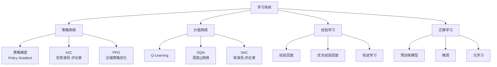

# Learning 学习子系统

## 📚 概述

学习子系统负责 Agent 的策略优化、模型训练和知识更新。它是整个 Agent 的"大脑"，通过与环境的交互不断改进自身的决策能力。

## 🏗️ 架构设计



## 🔧 核心算法

### 1. PPO (近端策略优化)

**推荐算法**：PPO 是代码 Agent 的首选算法

```python
class PPO:
    def __init__(self, policy_net, value_net, lr=3e-4, gamma=0.99, clip_ratio=0.2):
        self.policy_net = policy_net
        self.value_net = value_net
        self.lr = lr
        self.gamma = gamma
        self.clip_ratio = clip_ratio
        
    def update(self, trajectories):
        states, actions, rewards, next_states, dones = self.process_trajectories(trajectories)
        
        # 计算优势函数
        advantages = self.compute_advantages(states, rewards, next_states, dones)
        
        # PPO 策略更新
        old_log_probs = self.policy_net.log_prob(states, actions)
        
        for _ in range(self.epochs):
            log_probs = self.policy_net.log_prob(states, actions)
            ratio = torch.exp(log_probs - old_log_probs)
            
            # Clipped 目标
            surr1 = ratio * advantages
            surr2 = torch.clamp(ratio, 1 - self.clip_ratio, 1 + self.clip_ratio) * advantages
            policy_loss = -torch.min(surr1, surr2).mean()
            
            # 价值函数更新
            value_loss = F.mse_loss(self.value_net(states), rewards)
            
            # 总损失
            total_loss = policy_loss + 0.5 * value_loss
            
            self.optimizer.zero_grad()
            total_loss.backward()
            self.optimizer.step()
```

### 2. 代码特定优化策略

| 策略 | 描述 | 适用场景 |
|------|------|----------|
| **代码语法学习** | 学习 AST 结构和语法规则 | 代码生成 |
| **代码风格学习** | 学习编码规范和最佳实践 | 代码重构 |
| **Bug 模式学习** | 识别常见错误模式 | 调试任务 |
| **测试用例学习** | 学习测试驱动开发 | 代码改进 |

## 🧠 模型架构

### 代码编码器

```python
class CodeEncoder(nn.Module):
    def __init__(self, vocab_size, embedding_dim=512, hidden_dim=1024):
        super().__init__()
        self.embedding = nn.Embedding(vocab_size, embedding_dim)
        
        # Transformer 编码器
        encoder_layer = nn.TransformerEncoderLayer(
            d_model=embedding_dim,
            nhead=8,
            dim_feedforward=hidden_dim,
            dropout=0.1
        )
        self.transformer = nn.TransformerEncoder(encoder_layer, num_layers=6)
        
        # 输出层
        self.output = nn.Linear(embedding_dim, hidden_dim)
        
    def forward(self, code_tokens):
        # code_tokens: (batch_size, seq_len)
        embeddings = self.embedding(code_tokens)  # (batch_size, seq_len, embedding_dim)
        encoded = self.transformer(embeddings.transpose(0, 1))  # (seq_len, batch_size, embedding_dim)
        
        # 使用 <[BOS_never_used_51bce0c785ca2f68081bfa7d91973934]> token 作为整体表示
        code_representation = self.output(encoded[0])  # (batch_size, hidden_dim)
        return code_representation
```

### 策略网络

```python
class PolicyNetwork(nn.Module):
    def __init__(self, state_dim, action_dim, hidden_dim=1024):
        super().__init__()
        
        self.state_encoder = CodeEncoder(vocab_size=50000)
        
        self.policy_head = nn.Sequential(
            nn.Linear(state_dim, hidden_dim),
            nn.ReLU(),
            nn.Dropout(0.1),
            nn.Linear(hidden_dim, hidden_dim),
            nn.ReLU(),
            nn.Linear(hidden_dim, action_dim)
        )
        
    def forward(self, state):
        # 状态编码
        state_repr = self.state_encoder(state['code'])
        
        # 动作概率
        action_logits = self.policy_head(state_repr)
        return F.softmax(action_logits, dim=-1)
```

## 📊 训练循环

```python
def training_loop(agent, environment, num_episodes=10000):
    for episode in range(num_episodes):
        state = environment.reset()
        episode_reward = 0
        trajectory = []
        
        # 收集轨迹
        while not done:
            # 选择动作
            action = agent.select_action(state)
            
            # 执行动作
            next_state, reward, done, info = environment.step(action)
            
            # 存储经验
            trajectory.append({
                'state': state,
                'action': action,
                'reward': reward,
                'next_state': next_state,
                'done': done
            })
            
            episode_reward += reward
            state = next_state
        
        # 学习更新
        agent.learn(trajectory)
        
        # 记录日志
        if episode % 100 == 0:
            print(f"Episode {episode}, Reward: {episode_reward:.2f}")
            save_checkpoint(agent, f"checkpoint_{episode}.pt")
```

## 🔬 学习策略

### 1. 课程学习 (Curriculum Learning)

```python
class CurriculumLearning:
    def __init__(self):
        self.task_difficulty = 0
        self.task_sequence = [
            "simple_edit",      # 简单编辑
            "code_completion",  # 代码补全
            "refactoring",      # 重构
            "bug_fixing",       # 修复bug
            "feature_dev"       # 功能开发
        ]
        
    def get_current_task(self):
        return self.task_sequence[min(self.task_difficulty, len(self.task_sequence)-1)]
    
    def update_difficulty(self, success_rate):
        if success_rate > 0.9:
            self.task_difficulty += 1
            print(f"难度提升至: {self.get_current_task()}")
```

### 2. 自监督预训练

```python
class SelfSupervisedPretraining:
    def __init__(self, code_corpus):
        self.code_corpus = code_corpus
        
    def mask_prediction_task(self, code):
        # 掩码预测任务：随机掩码 15% 的 token
        masked_code, targets = self.mask_tokens(code)
        return masked_code, targets
    
    def next_token_prediction(self, code):
        # 下一个 token 预测
        return code[:-1], code[1:]
    
    def code_infilling(self, code):
        # 代码填充任务
        return self.create_infilling_task(code)
```

### 3. 多任务学习

```python
class MultiTaskLearning:
    def __init__(self, tasks):
        self.tasks = tasks
        self.task_weights = {task: 1.0 for task in tasks}
        
    def compute_multi_task_loss(self, losses):
        total_loss = 0
        for task, loss in losses.items():
            total_loss += self.task_weights[task] * loss
        return total_loss
    
    def adaptive_weighting(self, task_performance):
        # 根据任务性能动态调整权重
        for task, perf in task_performance.items():
            if perf < 0.5:
                self.task_weights[task] *= 1.5
            else:
                self.task_weights[task] *= 0.9
```

## 📈 评估指标

| 指标 | 计算公式 | 目标值 |
|------|----------|--------|
| 策略损失 | $L_{policy} = -\mathbb{E}[\min(r_t(\theta)A_t, \text{clip}(r_t(\theta), 1-\epsilon, 1+\epsilon)A_t)]$ | ↓ 减小 |
| 价值损失 | $L_{value} = \mathbb{E}[(V(s_t) - R_t)^2]$ | ↓ 减小 |
| 熵正则化 | $H(\pi) = -\sum_a \pi(a|s)\log\pi(a|s)$ | 保持适中 |
| KL 散度 | $D_{KL}(\pi_{old} \|\| \pi_{new})$ | < 0.01 |
| 平均回报 | $\mathbb{E}[R]$ | ↑ 增大 |

## 🔧 配置参数

```yaml
learning:
  algorithm: "PPO"
  
  # 网络参数
  policy_lr: 3e-4
  value_lr: 1e-3
  hidden_dim: 1024
  num_layers: 6
  num_heads: 8
  
  # PPO 超参数
  gamma: 0.99
  lambda_: 0.95
  clip_ratio: 0.2
  epochs: 10
  batch_size: 64
  
  # 探索策略
  epsilon_start: 1.0
  epsilon_end: 0.01
  epsilon_decay: 0.995
  
  # 优化器
  optimizer: "Adam"
  weight_decay: 1e-5
  
  # 学习率调度
  lr_scheduler: "cosine"
  warmup_steps: 1000
```

## 🎯 最佳实践

1. **从简单任务开始**：使用课程学习逐步提升难度
2. **保持探索与利用平衡**：合理设置 epsilon 衰减
3. **定期保存检查点**：避免训练中断丢失进度
4. **监控关键指标**：KL 散度、策略熵、平均回报
5. **使用梯度裁剪**：防止梯度爆炸
6. **批量归一化**：稳定训练过程

## 📚 参考资料

- Schulman et al., "Proximal Policy Optimization Algorithms" (2017)
- Vaswani et al., "Attention Is All You Need" (2017)
- OpenAI Codex / GitHub Copilot 相关论文
- DeepMind AlphaCode 技术报告