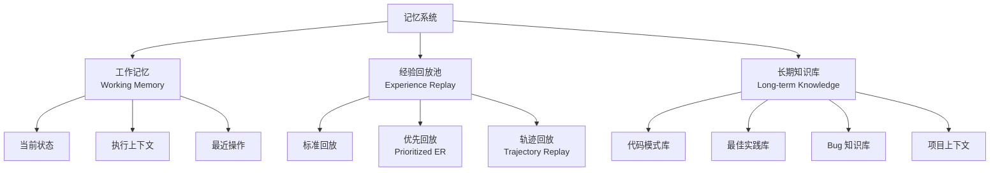

# Memory 记忆子系统

## 📚 概述

记忆子系统负责存储、检索和管理 Agent 的所有经验与知识。它采用三级记忆结构，模仿人类记忆系统，支持短期、中期和长期记忆。

## 🏗️ 架构设计



## 🧠 三级记忆结构

### 1. 工作记忆 (Working Memory)

**容量有限**：存储当前任务的上下文信息

```python
class WorkingMemory:
    def __init__(self, max_size=100):
        self.max_size = max_size
        self.memory = []
        self.current_state = None
        self.execution_context = {}
        
    def add(self, item):
        """添加项目到工作记忆"""
        self.memory.append(item)
        if len(self.memory) > self.max_size:
            self.memory.pop(0)  # FIFO
            
    def update_context(self, key, value):
        """更新执行上下文"""
        self.execution_context[key] = value
        
    def get_recent(self, n=10):
        """获取最近 n 项"""
        return self.memory[-n:]
    
    def clear(self):
        """清空工作记忆"""
        self.memory = []
        self.current_state = None
        self.execution_context = {}
```

### 2. 经验回放池 (Experience Replay)

**容量较大**：存储历史经验用于学习

```python
from collections import deque
import random
import numpy as np

class ExperienceReplayBuffer:
    def __init__(self, capacity=100000):
        self.buffer = deque(maxlen=capacity)
        
    def add(self, state, action, reward, next_state, done):
        """添加经验"""
        experience = (state, action, reward, next_state, done)
        self.buffer.append(experience)
        
    def sample(self, batch_size):
        """随机采样"""
        return random.sample(self.buffer, min(batch_size, len(self.buffer)))
    
    def __len__(self):
        return len(self.buffer)
```

### 3. 长期知识库 (Long-term Knowledge)

**持久存储**：代码模式、最佳实践等

```python
class LongTermKnowledge:
    def __init__(self):
        self.code_patterns = {}      # 代码模式库
        self.best_practices = {}    # 最佳实践库
        self.bug_knowledge = {}     # Bug 知识库
        self.project_context = {}   # 项目上下文
        
    def add_code_pattern(self, pattern_name, pattern_code, description=""):
        """添加代码模式"""
        self.code_patterns[pattern_name] = {
            'code': pattern_code,
            'description': description,
            'usage_count': 0,
            'success_rate': 0.0
        }
        
    def retrieve_similar(self, query, top_k=5):
        """检索相似内容"""
        # 使用向量相似度检索
        similarities = self._compute_similarities(query)
        return sorted(similarities.items(), key=lambda x: x[1], reverse=True)[:top_k]
    
    def update_usage_stats(self, pattern_name, success):
        """更新使用统计"""
        if pattern_name in self.code_patterns:
            pattern = self.code_patterns[pattern_name]
            pattern['usage_count'] += 1
            total = pattern['usage_count']
            current_rate = pattern['success_rate']
            pattern['success_rate'] = (current_rate * (total - 1) + (1.0 if success else 0.0)) / total
```

## 🔥 优先经验回放 (Prioritized Experience Replay)

```python
class PrioritizedExperienceReplay:
    def __init__(self, capacity=100000, alpha=0.6, beta=0.4):
        self.capacity = capacity
        self.alpha = alpha
        self.beta = beta
        self.buffer = []
        self.priorities = np.zeros(capacity, dtype=np.float32)
        self.position = 0
        
    def add(self, state, action, reward, next_state, done, td_error=1.0):
        """添加经验，使用 TD 误差作为优先级"""
        max_priority = self.priorities.max() if self.buffer else 1.0
        
        if len(self.buffer) < self.capacity:
            self.buffer.append((state, action, reward, next_state, done))
        else:
            self.buffer[self.position] = (state, action, reward, next_state, done)
            
        self.priorities[self.position] = max_priority
        self.position = (self.position + 1) % self.capacity
        
    def sample(self, batch_size):
        """根据优先级采样"""
        if len(self.buffer) == 0:
            return []
            
        priorities = self.priorities[:len(self.buffer)]
        probabilities = priorities ** self.alpha
        probabilities /= probabilities.sum()
        
        indices = np.random.choice(len(self.buffer), batch_size, p=probabilities)
        experiences = [self.buffer[i] for i in indices]
        
        # 计算重要性采样权重
        weights = (len(self.buffer) * probabilities[indices]) ** (-self.beta)
        weights /= weights.max()
        
        return experiences, indices, weights
    
    def update_priorities(self, indices, td_errors):
        """更新优先级"""
        for idx, td_error in zip(indices, td_errors):
            self.priorities[idx] = abs(td_error) + 1e-6
```

## 📝 轨迹记忆 (Trajectory Memory)

```python
class TrajectoryMemory:
    def __init__(self):
        self.trajectories = []
        self.current_trajectory = []
        
    def start_trajectory(self):
        """开始新轨迹"""
        self.current_trajectory = []
        
    def add_step(self, state, action, reward, next_state, done):
        """添加步骤到当前轨迹"""
        self.current_trajectory.append({
            'state': state,
            'action': action,
            'reward': reward,
            'next_state': next_state,
            'done': done
        })
        
    def end_trajectory(self, success):
        """结束当前轨迹"""
        self.trajectories.append({
            'steps': self.current_trajectory,
            'success': success,
            'total_reward': sum(step['reward'] for step in self.current_trajectory),
            'length': len(self.current_trajectory)
        })
        self.current_trajectory = []
        
    def get_successful_trajectories(self):
        """获取成功的轨迹"""
        return [t for t in self.trajectories if t['success']]
```

## 🔍 记忆检索

### 基于相似度的检索

```python
from sklearn.feature_extraction.text import TfidfVectorizer
from sklearn.metrics.pairwise import cosine_similarity

class MemoryRetriever:
    def __init__(self):
        self.vectorizer = TfidfVectorizer()
        self.memory_items = []
        self.memory_vectors = None
        
    def index(self, items):
        """建立索引"""
        self.memory_items = items
        texts = [item['content'] for item in items]
        self.memory_vectors = self.vectorizer.fit_transform(texts)
        
    def retrieve(self, query, top_k=5):
        """检索最相关的记忆"""
        query_vector = self.vectorizer.transform([query])
        similarities = cosine_similarity(query_vector, self.memory_vectors)[0]
        
        top_indices = similarities.argsort()[-top_k:][::-1]
        results = [
            (self.memory_items[i], similarities[i])
            for i in top_indices
            if similarities[i] > 0.1  # 阈值过滤
        ]
        return results
```

## 💾 持久化

```python
import pickle
import json

class MemoryPersistence:
    @staticmethod
    def save_memory(memory, filepath):
        """保存记忆到文件"""
        with open(filepath, 'wb') as f:
            pickle.dump(memory, f)
            
    @staticmethod
    def load_memory(filepath):
        """从文件加载记忆"""
        with open(filepath, 'rb') as f:
            return pickle.load(f)
            
    @staticmethod
    def export_knowledge(knowledge, filepath):
        """导出知识库为 JSON"""
        data = {
            'code_patterns': knowledge.code_patterns,
            'best_practices': knowledge.best_practices,
            'bug_knowledge': knowledge.bug_knowledge
        }
        with open(filepath, 'w', encoding='utf-8') as f:
            json.dump(data, f, ensure_ascii=False, indent=2)
```

## 📊 记忆统计

```python
class MemoryStatistics:
    def __init__(self, memory_system):
        self.memory = memory_system
        
    def get_statistics(self):
        """获取记忆统计信息"""
        return {
            'working_memory_size': len(self.memory.working_memory.memory),
            'experience_buffer_size': len(self.memory.experience_buffer),
            'total_trajectories': len(self.memory.trajectory_memory.trajectories),
            'successful_trajectories': len(self.memory.trajectory_memory.get_successful_trajectories()),
            'code_patterns_count': len(self.memory.long_term_knowledge.code_patterns),
            'knowledge_usage': self._get_knowledge_usage()
        }
        
    def _get_knowledge_usage(self):
        """获取知识使用情况"""
        patterns = self.memory.long_term_knowledge.code_patterns
        return {
            name: {
                'usage_count': p['usage_count'],
                'success_rate': p['success_rate']
            }
            for name, p in patterns.items()
        }
```

## 🔧 配置参数

```yaml
memory:
  # 工作记忆
  working_memory:
    max_size: 100
    context_ttl: 3600  # 上下文过期时间（秒）
    
  # 经验回放
  experience_replay:
    capacity: 100000
    type: "prioritized"  # standard, prioritized, trajectory
    alpha: 0.6
    beta: 0.4
    beta_annealing: 0.001
    
  # 长期记忆
  long_term_knowledge:
    pattern_min_support: 0.05
    similarity_threshold: 0.7
    
  # 持久化
  persistence:
    save_interval: 1000  # 每 1000 步保存一次
    checkpoint_dir: "./checkpoints/memory"
    knowledge_export_dir: "./knowledge"
```

## 🎯 记忆管理策略

| 策略 | 描述 | 适用场景 |
|------|------|----------|
| **FIFO** | 先进先出 | 工作记忆 |
| **LRU** | 最近最少使用 | 长期知识 |
| **优先级** | 基于 TD 误差 | 经验回放 |
| **衰减** | 时间权重衰减 | 旧经验 |

## 📚 参考资料

- Mnih et al., "Human-level control through deep reinforcement learning" (2015)
- Schaul et al., "Prioritized Experience Replay" (2015)
- Miller, "The magical number seven, plus or minus two" (1956)