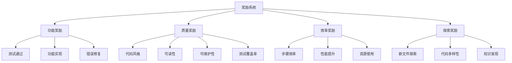

# Reward 奖励子系统

## 📚 概述

奖励子系统负责设计和计算 Agent 在代码任务中的奖励信号，引导 Agent 学习正确的行为。它是强化学习的"指南针"，告诉 Agent 什么是好的，什么是坏的。

## 🏗️ 架构设计



## 🎯 核心奖励函数

### 1. 功能正确性奖励

```python
class FunctionalityReward:
    @staticmethod
    def test_pass_reward(test_result: dict) -> float:
        """测试通过奖励"""
        if not test_result['success']:
            return -1.0
            
        if test_result.get('passed', False):
            # 所有测试通过
            return 10.0
        elif 'report' in test_result and test_result['report']:
            # 部分测试通过
            passed = test_result['report'].get('summary', {}).get('passed', 0)
            total = test_result['report'].get('summary', {}).get('total', 1)
            return (passed / total) * 5.0
        else:
            return 0.0
    
    @staticmethod
    def bug_fix_reward(original_errors: int, fixed_errors: int) -> float:
        """Bug 修复奖励"""
        if fixed_errors < original_errors:
            fixed = original_errors - fixed_errors
            return fixed * 2.0
        elif fixed_errors > original_errors:
            return -2.0
        else:
            return 0.0
    
    @staticmethod
    def feature_implementation_reward(goal_achieved: bool, progress: float) -> float:
        """功能实现奖励"""
        if goal_achieved:
            return 20.0
        else:
            return progress * 5.0
```

### 2. 代码质量奖励

```python
import ast
import re

class CodeQualityReward:
    @staticmethod
    def style_reward(old_code: str, new_code: str, linter_result: dict) -> float:
        """代码风格奖励"""
        reward = 0.0
        
        # Lint 检查通过
        if linter_result.get('clean', False):
            reward += 2.0
        else:
            # 计算 lint 错误减少
            old_errors = CodeQualityReward._count_lint_errors(old_code)
            new_errors = CodeQualityReward._count_lint_errors(new_code)
            if new_errors < old_errors:
                reward += (old_errors - new_errors) * 0.5
            elif new_errors > old_errors:
                reward -= (new_errors - old_errors) * 0.5
        
        return reward
    
    @staticmethod
    def _count_lint_errors(code: str) -> int:
        """简单估算代码问题数量"""
        errors = 0
        # 检查行长度
        lines = code.split('\n')
        for line in lines:
            if len(line) > 100:
                errors += 1
        # 检查命名规范
        bad_names = re.findall(r'\b[a-z]+_[a-z]+\b', code)  # 简化检查
        return errors
    
    @staticmethod
    def readability_reward(old_code: str, new_code: str) -> float:
        """可读性奖励"""
        reward = 0.0
        
        # 注释比例
        old_comment_ratio = CodeQualityReward._comment_ratio(old_code)
        new_comment_ratio = CodeQualityReward._comment_ratio(new_code)
        if new_comment_ratio > old_comment_ratio:
            reward += 1.0
        
        # 函数/类文档字符串
        old_docstrings = CodeQualityReward._count_docstrings(old_code)
        new_docstrings = CodeQualityReward._count_docstrings(new_code)
        if new_docstrings > old_docstrings:
            reward += (new_docstrings - old_docstrings) * 0.5
        
        return reward
    
    @staticmethod
    def _comment_ratio(code: str) -> float:
        """计算注释比例"""
        lines = code.split('\n')
        comment_lines = sum(1 for line in lines if line.strip().startswith('#'))
        return comment_lines / max(len(lines), 1)
    
    @staticmethod
    def _count_docstrings(code: str) -> int:
        """计算文档字符串数量"""
        try:
            tree = ast.parse(code)
            count = 0
            for node in ast.walk(tree):
                if isinstance(node, (ast.FunctionDef, ast.ClassDef)):
                    if ast.get_docstring(node):
                        count += 1
            return count
        except:
            return 0
    
    @staticmethod
    def maintainability_reward(old_code: str, new_code: str) -> float:
        """可维护性奖励"""
        reward = 0.0
        
        # 函数长度
        old_avg_func_len = CodeQualityReward._avg_function_length(old_code)
        new_avg_func_len = CodeQualityReward._avg_function_length(new_code)
        if new_avg_func_len < old_avg_func_len and new_avg_func_len > 0:
            reward += 1.0
        
        # 复杂度（简化估算）
        old_complexity = CodeQualityReward._estimate_complexity(old_code)
        new_complexity = CodeQualityReward._estimate_complexity(new_code)
        if new_complexity < old_complexity:
            reward += 2.0
        
        return reward
    
    @staticmethod
    def _avg_function_length(code: str) -> float:
        """计算平均函数长度"""
        try:
            tree = ast.parse(code)
            func_lengths = []
            for node in ast.walk(tree):
                if isinstance(node, ast.FunctionDef):
                    func_lengths.append(node.end_lineno - node.lineno + 1)
            return sum(func_lengths) / max(len(func_lengths), 1)
        except:
            return 0.0
    
    @staticmethod
    def _estimate_complexity(code: str) -> int:
        """估算代码复杂度"""
        # 统计 if/for/while/try/with 等关键字数量
        complexity = 0
        keywords = ['if', 'for', 'while', 'try', 'with', 'except', 'elif', 'and', 'or']
        for keyword in keywords:
            complexity += len(re.findall(rf'\b{keyword}\b', code))
        return complexity
    
    @staticmethod
    def test_coverage_reward(coverage_data: dict) -> float:
        """测试覆盖率奖励"""
        if 'percent_covered' in coverage_data:
            coverage = coverage_data['percent_covered']
            if coverage >= 90:
                return 5.0
            elif coverage >= 80:
                return 3.0
            elif coverage >= 70:
                return 1.0
            else:
                return 0.0
        return 0.0
```

### 3. 效率奖励

```python
class EfficiencyReward:
    @staticmethod
    def step_efficiency_reward(steps_taken: int, optimal_steps: int) -> float:
        """步骤效率奖励"""
        if steps_taken <= optimal_steps:
            return 3.0
        else:
            # 超出最优步骤数，给予递减奖励
            ratio = optimal_steps / steps_taken
            return ratio * 2.0
    
    @staticmethod
    def performance_reward(old_performance: float, new_performance: float) -> float:
        """性能提升奖励"""
        if new_performance > old_performance:
            improvement = (new_performance - old_performance) / old_performance
            return min(improvement * 10, 5.0)  # 最多奖励 5 分
        elif new_performance < old_performance:
            regression = (old_performance - new_performance) / old_performance
            return -min(regression * 10, 3.0)  # 最多惩罚 3 分
        else:
            return 0.0
    
    @staticmethod
    def resource_usage_reward(resource_change: dict) -> float:
        """资源使用奖励"""
        reward = 0.0
        
        # 内存使用减少
        if 'memory' in resource_change:
            if resource_change['memory'] < 0:
                reward += 1.0
            elif resource_change['memory'] > 0:
                reward -= 0.5
        
        # 执行时间减少
        if 'time' in resource_change:
            if resource_change['time'] < 0:
                reward += 1.0
            elif resource_change['time'] > 0:
                reward -= 0.5
        
        return reward
```

### 4. 探索奖励

```python
import numpy as np

class ExplorationReward:
    def __init__(self):
        self.visited_files = set()
        self.used_patterns = set()
    
    def new_file_reward(self, filepath: str) -> float:
        """新文件探索奖励"""
        if filepath not in self.visited_files:
            self.visited_files.add(filepath)
            return 0.5
        return 0.0
    
    def code_diversity_reward(self, code_pattern: str) -> float:
        """代码多样性奖励"""
        if code_pattern not in self.used_patterns:
            self.used_patterns.add(code_pattern)
            return 0.3
        return 0.0
    
    def knowledge_discovery_reward(self, discovery: dict) -> float:
        """知识发现奖励"""
        if discovery.get('is_new', False):
            return 1.0
        return 0.0
    
    def curiosity_reward(self, state_uncertainty: float) -> float:
        """好奇心奖励（基于不确定性）"""
        return state_uncertainty * 0.5
    
    def reset(self):
        """重置探索状态"""
        self.visited_files.clear()
        self.used_patterns.clear()
```

## 🎯 综合奖励计算器

```python
class RewardCalculator:
    def __init__(self, weights: dict = None):
        self.weights = weights or {
            'functionality': 0.4,
            'quality': 0.3,
            'efficiency': 0.2,
            'exploration': 0.1
        }
        
        self.functionality = FunctionalityReward()
        self.quality = CodeQualityReward()
        self.efficiency = EfficiencyReward()
        self.exploration = ExplorationReward()
        
        self.total_reward = 0.0
        self.reward_history = []
    
    def calculate(self, state: dict, action: dict, next_state: dict, info: dict) -> float:
        """计算综合奖励"""
        rewards = {}
        
        # 功能奖励
        if 'test_result' in info:
            rewards['functionality'] = self.functionality.test_pass_reward(info['test_result'])
        else:
            rewards['functionality'] = 0.0
        
        # 质量奖励
        if 'old_code' in state and 'new_code' in next_state:
            style_reward = self.quality.style_reward(
                state['old_code'],
                next_state['new_code'],
                info.get('linter_result', {})
            )
            readability_reward = self.quality.readability_reward(
                state['old_code'],
                next_state['new_code']
            )
            maintainability_reward = self.quality.maintainability_reward(
                state['old_code'],
                next_state['new_code']
            )
            rewards['quality'] = style_reward + readability_reward + maintainability_reward
        else:
            rewards['quality'] = 0.0
        
        # 效率奖励
        if 'steps_taken' in info:
            rewards['efficiency'] = self.efficiency.step_efficiency_reward(
                info['steps_taken'],
                info.get('optimal_steps', 10)
            )
        else:
            rewards['efficiency'] = 0.0
        
        # 探索奖励
        if 'filepath' in action:
            rewards['exploration'] = self.exploration.new_file_reward(action['filepath'])
        else:
            rewards['exploration'] = 0.0
        
        # 加权求和
        total_reward = sum(
            self.weights[key] * reward
            for key, reward in rewards.items()
        )
        
        # 稀疏奖励（任务完成）
        if info.get('task_complete', False):
            total_reward += 50.0
        
        # 记录奖励
        self.total_reward += total_reward
        self.reward_history.append({
            'rewards': rewards,
            'total': total_reward,
            'action': action
        })
        
        return total_reward
    
    def get_statistics(self) -> dict:
        """获取奖励统计"""
        if not self.reward_history:
            return {}
        
        rewards_list = [h['total'] for h in self.reward_history]
        return {
            'total': self.total_reward,
            'mean': np.mean(rewards_list),
            'std': np.std(rewards_list),
            'max': np.max(rewards_list),
            'min': np.min(rewards_list),
            'positive_count': sum(1 for r in rewards_list if r > 0),
            'negative_count': sum(1 for r in rewards_list if r < 0)
        }
    
    def reset(self):
        """重置奖励计算器"""
        self.total_reward = 0.0
        self.reward_history = []
        self.exploration.reset()
```

## 📊 奖励塑造 (Reward Shaping)

```python
class RewardShaping:
    @staticmethod
    def potential_based_reward(state: dict, next_state: dict, gamma: float = 0.99) -> float:
        """基于势函数的奖励塑造"""
        # 势函数：距离目标的进度
        potential_current = RewardShaping._potential(state)
        potential_next = RewardShaping._potential(next_state)
        return gamma * potential_next - potential_current
    
    @staticmethod
    def _potential(state: dict) -> float:
        """计算势函数值"""
        potential = 0.0
        
        # 测试通过比例
        if 'test_progress' in state:
            potential += state['test_progress'] * 10.0
        
        # 代码质量评分
        if 'quality_score' in state:
            potential += state['quality_score'] * 5.0
        
        # 任务完成度
        if 'task_progress' in state:
            potential += state['task_progress'] * 20.0
        
        return potential
    
    @staticmethod
    def reward_clipping(reward: float, min_reward: float = -10, max_reward: float = 10) -> float:
        """奖励裁剪"""
        return max(min(reward, max_reward), min_reward)
    
    @staticmethod
    def reward_normalization(rewards: list) -> list:
        """奖励归一化"""
        if not rewards:
            return []
        
        mean = np.mean(rewards)
        std = np.std(rewards) + 1e-8
        return [(r - mean) / std for r in rewards]
```

## 🔧 配置参数

```yaml
reward:
  # 权重配置
  weights:
    functionality: 0.4
    quality: 0.3
    efficiency: 0.2
    exploration: 0.1
  
  # 功能奖励
  functionality:
    test_pass: 10.0
    test_partial: 5.0
    bug_fix: 2.0
    feature_complete: 20.0
  
  # 质量奖励
  quality:
    style_clean: 2.0
    comment_improvement: 1.0
    docstring_added: 0.5
    complexity_reduced: 2.0
    coverage_90: 5.0
    coverage_80: 3.0
    coverage_70: 1.0
  
  # 效率奖励
  efficiency:
    optimal_steps: 3.0
    performance_improvement: 5.0
    resource_saving: 1.0
  
  # 探索奖励
  exploration:
    new_file: 0.5
    new_pattern: 0.3
    knowledge_discovery: 1.0
    curiosity: 0.5
  
  # 任务奖励
  task:
    complete: 50.0
    bonus: 100.0
  
  # 奖励塑造
  shaping:
    enable_potential: true
    enable_clipping: true
    clip_min: -10
    clip_max: 10
    enable_normalization: true
    gamma: 0.99
```

## 🎯 奖励设计原则

1. **稀疏奖励 + 密集奖励**：任务完成给大奖励，每步给小奖励
2. **奖励塑造**：使用势函数加速学习
3. **奖励归一化**：稳定训练过程
4. **奖励裁剪**：避免极端值
5. **平衡探索与利用**：适当的探索奖励

## 📚 参考资料

- Sutton & Barto, "Reinforcement Learning: An Introduction" (2018)
- Ng et al., "Policy invariance under reward transformations" (1999)
- OpenAI Spinning Up - Reward Design